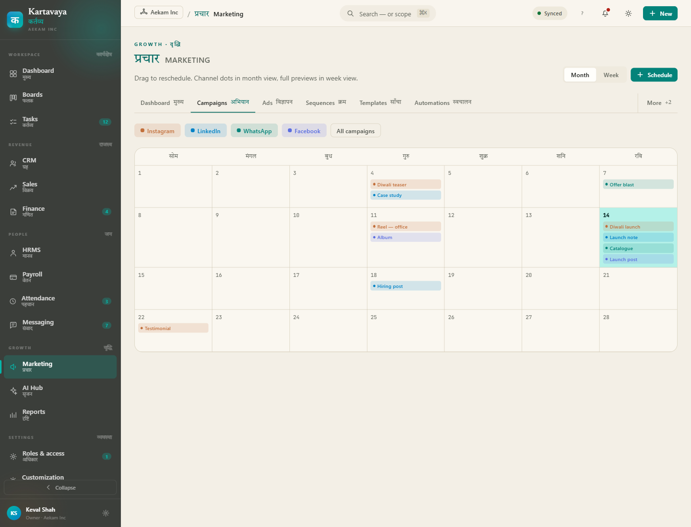
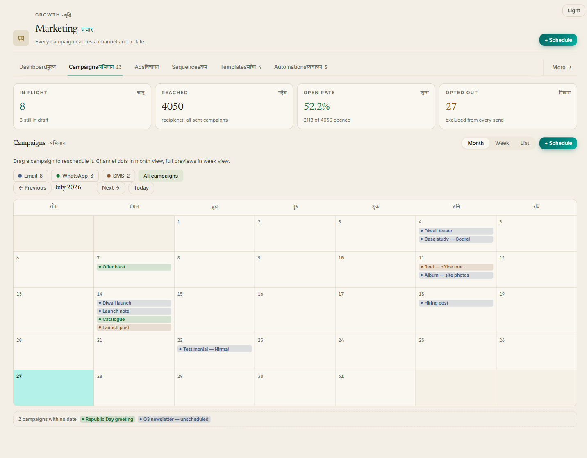
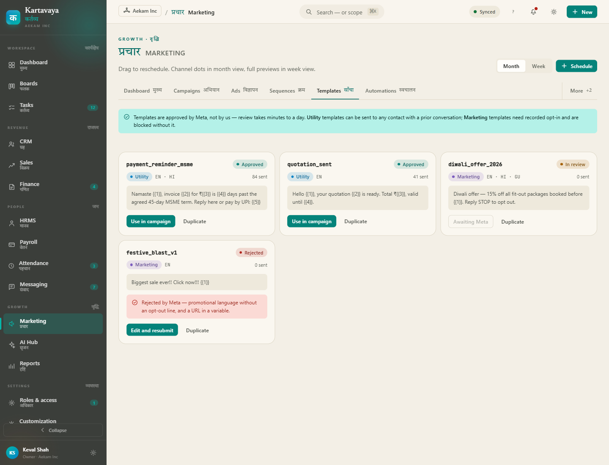
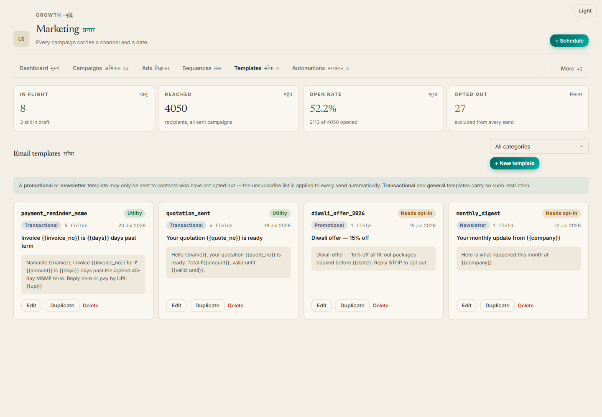
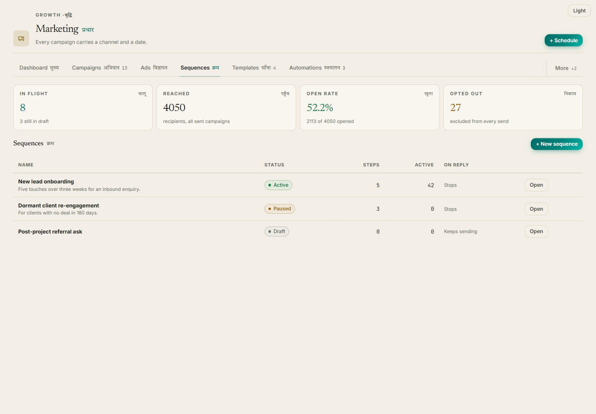
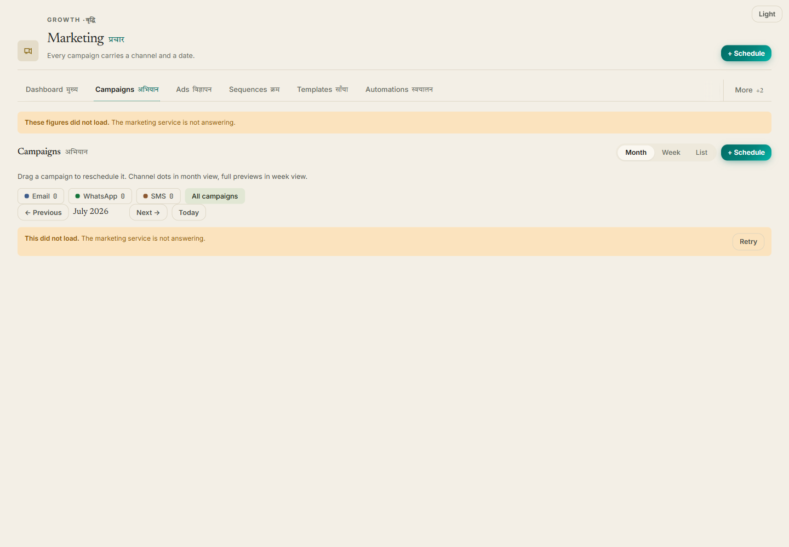
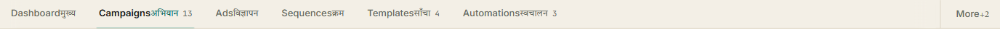
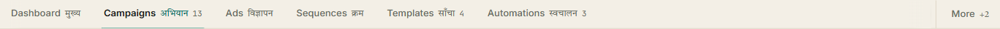
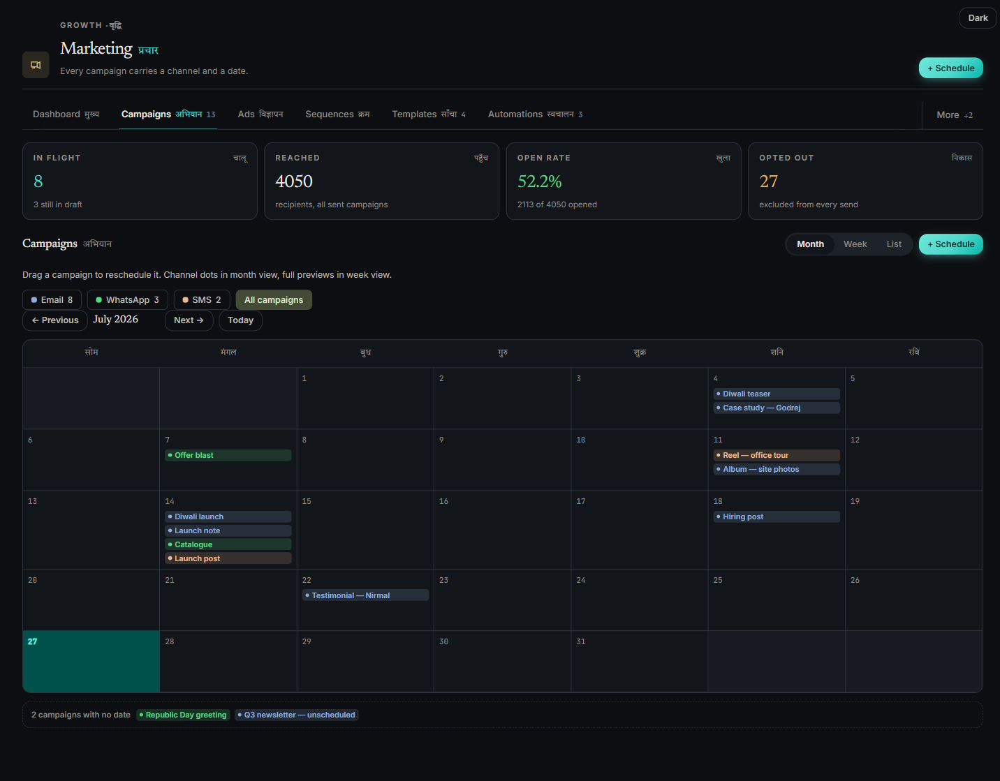

# Prachar · प्रचार — split, then styled

Branch `worktree-agent-a7cb25a131d57f34b`, off `staging`.
Commits `29cdf0ae` (split + restyle + behaviour fixes) and `8efd38c5` (three
defects found by rendering).

**Deliverable is the page, not a table.** The tables below exist only where a
number is the shortest way to say what changed.

---

## 1 · What was actually wrong

`PracharPage.jsx` was **1,021 lines, 108 inline styles, 0 tab files** — one of
the four modules never split. That is the diagnosed cause and it was correct,
but it was not the whole story. Reading the file against
`backend/routers/prachar.py` turned up something worse:

> **Five of the eight tabs could not render at all.**

`lib/api` is a bare axios instance, so `api.get(p)` resolves to the **response**,
and every Prachar list route answers `{"data": [...]}`. The array is
`r.data.data`. Campaigns, Templates, Automations, Unsubscribes and Events all
did `setX(r.data)` and then `X.map(…)` on the wrapper object — a `TypeError`
that takes the tab down to a blank panel. Ads set state to the axios object
itself, so **every ad spend figure on the page rendered `0`**.

This is why "half baked" undersells it. The module was not under-styled; most of
it was inoperative.

---

## 2 · The shape now

```
frontend/src/pages/PracharPage.jsx        141 lines   (was 1,021)
frontend/src/pages/prachar/
  _shared.jsx        262   loader, unwrapping, colour + channel vocabulary
  DashboardTab.jsx   144
  CampaignsTab.jsx   601   the calendar
  AdsTab.jsx         288
  SequencesTab.jsx   470
  TemplatesTab.jsx   257
  AutomationsTab.jsx 200
  UnsubscribesTab.jsx 148
  EventsTab.jsx      405
frontend/src/styles/prachar.css           572   the .pr__* vocabulary
```

### Inline styles: 108 → 8

All eight remaining are `style={{ '--c': … }}` — a **custom property**, not a
value. That is the pattern `check-tokens.mjs` deviation 2 names as correct for
per-instance colour, and it is what `StatusChip`, `Tag` and `AccentGrid` already
do. **Raw CSS property values in markup: zero.**

| | before | after |
|---|---|---|
| route file | 1,021 lines | 141 |
| inline `style={{…}}` | 108 | 8, all `--c` |
| raw property values inline | 108 | **0** |
| tab component files | 0 | 9 |

For scale: Graha, the reference-quality module, still carries 575 inline styles
across its 20 tab files.

---

## 3 · Reference vs build

### Campaigns — the screen the design is built around

The reference is almost entirely one surface: channel chips over a seven-column
month grid, campaigns as tinted pills on the day they go out, *"Drag to
reschedule. Channel dots in month view, full previews in week view."*

The build had **a flat vertical list of cards with no date on them** — on a
module whose only irreducible question is what goes out and when.

| reference | build |
|---|---|
|  |  |

Everything on that grid is real. `prachar_campaigns` has carried `scheduled_at`
and `channel` since migration 021, and `PATCH /campaigns/{id}` has always
accepted a new `scheduled_at` — so the drag writes through. No mock data.

Three decisions the reference could not make for me:

- **The month is real.** The reference hard-codes 28 cells from a Monday. Lead
  blanks and length are derived from the month shown; `mondayIndex()` exists
  because `getDay()` is Sunday-first and would shift the whole grid one column.
- **Unscheduled campaigns get a tray.** A campaign with no date cannot sit on a
  grid, and dropping it silently would make the calendar under-report work in
  flight. It can be dragged onto a day to schedule it.
- **Sent campaigns are not draggable.** `prachar.py:255` refuses a `PATCH` once a
  campaign is sending or sent. Those pills say why on hover instead of failing
  after the drop.

Day keys are built from local `getFullYear/Month/Date`, never `toISOString()` —
UTC would file a 1 a.m. IST campaign on the previous day for every user in the
country.

### Templates

| reference | build |
|---|---|
|  |  |

**One honest divergence.** The reference's cards are WhatsApp templates with a
Meta approval state (`Approved` / `In review` / `Rejected`) and a rejection
reason. `staging.prachar_templates` has **no approval column** — these are the
org's own email templates and there is nobody to approve them. Inventing an
"Approved" tag for a field that does not exist would be a lie in the UI, so the
tag position carries the distinction that *is* real and *is* consequential:
promotional and newsletter templates may only go to contacts who have not opted
out. That is the same fact the reference's note states, sourced from a column
that exists.

Merge fields are now **derived from the body** (`{{name}}` → `variables`). The
old form sent `variables: []` on every save, so the column was written empty
every time and what a template actually used was recorded nowhere.

### Sequences



Every column here is one the list route computes and the old UI ignored. It
rendered `s.channel` instead — a column that does not exist on
`prachar_sequences` — so **every row read "undefined"**.

---

## 4 · Loading / empty / **error**

The named defect: *a failed fetch must never render as an empty state.* It was
shipping on all eight tabs. Each did

```js
loading ? <Shimmer/> : list.length === 0 ? <Empty/> : rows
```

with the failure path being a `.catch` that pushed a toast and left `list` at
`[]`. So a 500 and a genuinely empty account rendered the same illustration —
*"No campaigns yet. Create your first marketing campaign"* on top of a server
that is down, which is precisely how a user creates a duplicate of something
they already have.

`useResource` + `<Panel>` in `_shared.jsx` make them three states, and **error
outranks empty** unconditionally:



`errText()` turns an axios failure into a sentence a person can act on. The old
code passed `e.message` into a toast, which on a 403 reads *"Request failed with
status code 403"* — a string that helps nobody, user or support.

Verified: all 8 tabs render, **0 runtime errors, 0 false empty states**, and
with the fixture forced to 500 every panel shows the warn note and a Retry.

---

## 5 · Behaviour defects fixed (all verified against `prachar.py`)

| # | Defect | Consequence |
|---|---|---|
| 1 | 5 tabs `.map()` on `{data:[…]}` | blank tab |
| 2 | Ads read the axios response object | every spend figure `0` |
| 3 | `POST /sequences` sent `{name, channel, status}`; model is `{name, description, exit_on_reply}` | `exit_on_reply` — whether a contact who **replies** keeps getting the drip — unreachable from the UI |
| 4 | Sequence list rendered non-existent `s.channel` | "undefined" on every row |
| 5 | Step form offered **SMS**; `add_step` validates `(email, whatsapp, call_task, manual)` | every SMS step 400'd |
| 6 | Enrolment asked users to type comma-separated **UUIDs** | now a contact picker |
| 7 | Event edit did `starts_at.slice(0,16)` into `datetime-local` — the UTC clock face | open an event, press Save, it moves back 5½ hours |
| 8 | 8 bare `await api.post(...)` with no try/catch | form stays open, nothing said, user presses again |
| 9 | Delete had no confirmation on templates, automations, events, unsubscribes | an event took its registrations with it |
| 10 | Automations had no pause — only Delete, though `PATCH` accepts `is_active` | pausing meant destroying and retyping |
| 11 | Event status filter fed `empty`, so filtering to "Cancelled" showed *"No events yet — create one"* | invited a duplicate |
| 12 | `max_attendees` collected and never used | registration past capacity |

Endpoints that existed and were never called, now wired:
`GET /campaigns/{id}/stats`, `GET /campaigns/{id}/audience`,
`GET /sequences/{id}`, `DELETE /sequences/{id}/steps/{order}`,
`PATCH /sequences/{id}`, `PATCH /automations/{id}`.

**No new endpoints were needed** — the API already covered every panel the
reference draws. No migrations, no DB writes.

---

## 6 · Found by rendering, not by reading

**Module tabs ran the two scripts together — on every module page in the
product.** `.mt__b` is not a flex container and neither `.mt__en` nor `.mt__hi`
carried a margin. Measured live: `en.right === hi.left`, exactly `0px`.

| before | after |
|---|---|
|  |  |

Fixed in `module.css` with the same `6px` `.mt__n` directly beneath it already
used. **This touches every module page** — deliberately, because the bug is in
the shared chrome, not in Prachar.

Two more:

- `useTabPanelMotion` returns `{ key, style }` and the page spread both onto the
  panel. React warns, and **React 19 drops a spread `key` silently** — the key is
  the entire mechanism (it remounts the panel so the CSS animation restarts).
  Destructured out and passed directly.
- `.k-formpanel__input` is `width: 100%`, right in a form column and wrong in a
  toolbar: the Templates filter claimed the whole trailing group and pushed
  "+ New template" onto a second row.

Dark theme verified — every tint, including the channel pills and the today
cell, flips correctly:



---

## 7 · Devanagari

`--font-hindi` (Tiro, single weight 400) with `lang="hi"`, never tracked, never
uppercased — `.pr__bar-hi`, `.pr__cal-dow`, `.pr__week-dow`. The calendar day
names are the reference's own `सोम मंगल बुध गुरु शुक्र शनि रवि`, Monday-first, each
carrying its English as a `title`. Tab Devanagari comes from the already-ported
`TAB_HI`. `.mk__hi` in the KPI strip was already correct and is untouched.

---

## 8 · Gates

```
cd frontend && node scripts/check-tokens.mjs && node scripts/check-classes.mjs && npx vite build
```

```
check-tokens:  344 declared, 239 referenced, 0 missing
check-classes: 2328 selectors defined, 1622 used, 0 missing a rule
vite build:    ✓ built in 5.46s
```

Green on both commits.

---

## 9 · For whoever comes next

1. **`GrahaPage.jsx` still spreads `key`** into its tab panel (`:160`). Same
   React-19 hazard; not changed from here because it is not this branch's file.
2. **Graha, Ganit and Manav are split but not de-inlined** — 575 inline styles
   across Graha's 20 tab files, including `fontSize: 13` and `padding: 24`
   literals that ignore the Text size and radius controls. Splitting was only
   half of what the convention asks for.
3. **`.mt` is a name collision** — `module.css` and `boards.css` both use it for
   unrelated objects, worked around with `[role="tablist"]` scoping. The note in
   `module.css:115` asks for a rename and it has not happened.
4. **Two `.k-badge` rules** in `editorial.css`, one silently winning on source
   order (noted at `:3322`).
5. Prachar campaigns are `email | sms | whatsapp`. The reference's four social
   channels (Instagram, LinkedIn, Facebook) have no backing column. If social
   publishing lands, `CHANNELS` in `prachar/_shared.jsx` is the one place to
   extend, and the calendar picks it up for free.

### Environment notes for the next agent

- **`frontend/node_modules` does not exist in a fresh worktree.** A directory
  junction to the main checkout's copy avoids a full install:
  `New-Item -ItemType Junction -Path <wt>/frontend/node_modules -Target D:\Projects\Kartavya\frontend\node_modules`
- **This worktree's branch was created from a stale ref** — 13 commits of `main`
  lineage, no `PracharPage.jsx` on disk at all. `git reset --hard staging` first
  and check `git log` before believing the tree.
- **The dev server on 5173 and the Playwright browser are shared.** A sibling
  navigated my page to `localhost:5271/vikray` mid-session; the
  `location.href.includes(':5247')` guard at the top of every `evaluate` caught
  it. Assert the URL in the same call that reads the DOM, not in a call before.
- **The scratchpad has name collisions** — `msg1.txt`/`msg2.txt` already existed
  from other agents. Prefix scratch files with your branch id.
- The render harness is `frontend/__probe.html` + `frontend/src/__probe.jsx`,
  both gitignored. It stubs `XMLHttpRequest` **before** axios loads, so it can
  never reach a deployed backend — staging and production share one Supabase
  project. `?fail=1` forces every route to 500 so the error states can be
  photographed; `?theme=dark` for the other palette.
